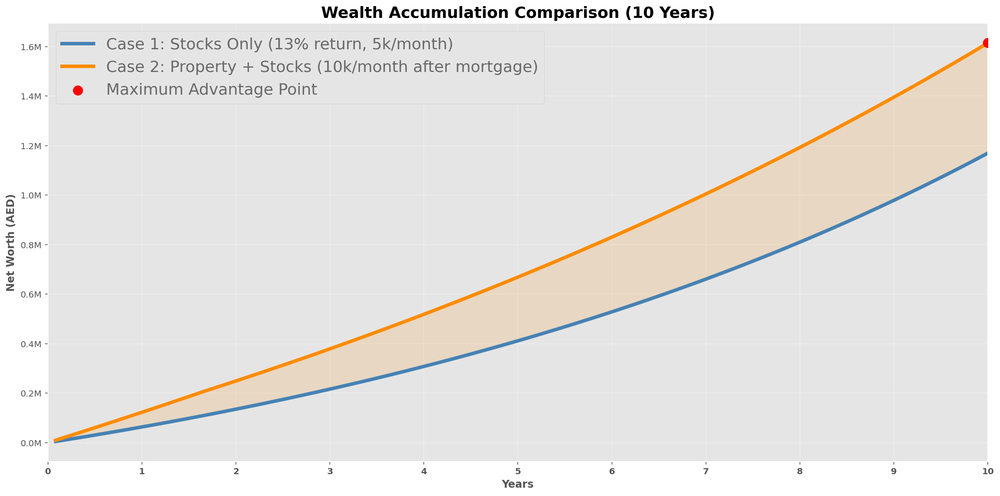
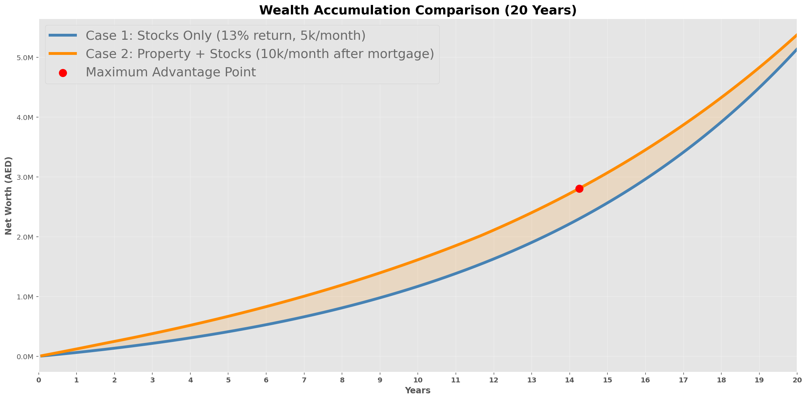
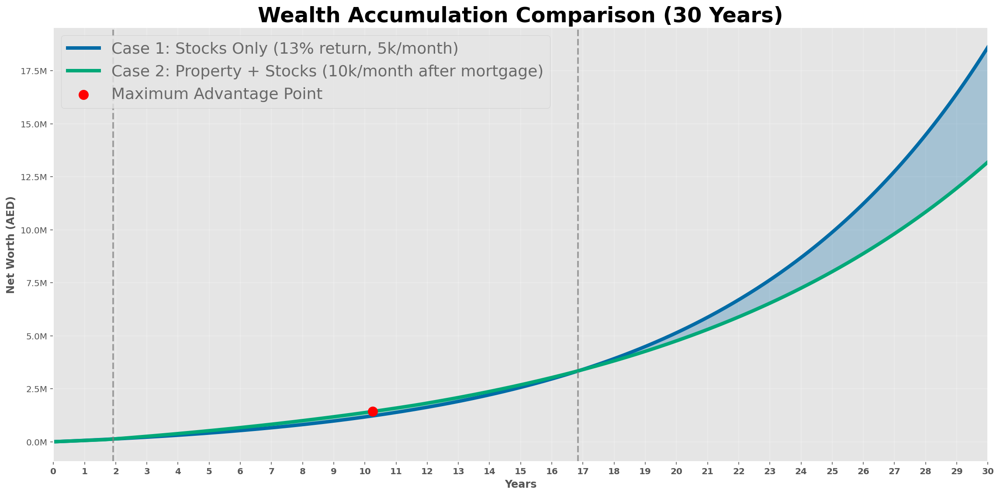
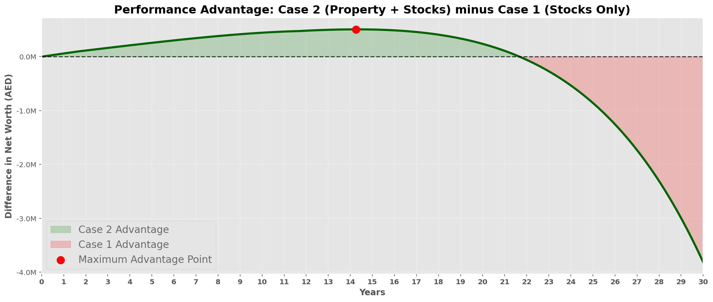

# 🏠 Stocks vs Property: A 30-Year Wealth Simulation

## Overview

This project started from a simple argument between my friend and I:

### Friend (Stocks Only)

> "Why buy a property? I'll rent forever and invest everything into stocks. If I can achieve 13% annual returns, I'll end up richer."

### Me (Property + Stocks)

> "I'd rather buy a property early, stop paying rent, build equity through a mortgage, and continue investing in stocks. Even if my stock returns are lower (10%), I think owning an appreciating asset will outperform in the long run."

Instead of debating opinions, we decided to simulate both strategies using Python and compare their net worth over time.

The model is fully parameterized, allowing anyone to adjust assumptions such as:

* Monthly investment amount
* Property price
* Mortgage terms
* Stock returns
* Property appreciation
* Simulation duration

The goal is not to determine a universal winner, but rather:

> **At what point does each strategy perform better, and under what assumptions?**

---

# Strategies Compared

## Case 1: Stocks Only

The investor:

* Rents indefinitely
* Invests AED 5,000/month into stocks
* Achieves 13% annual returns
* Never purchases property

Net Worth:

```text
Net Worth = Stock Portfolio
```

---

## Case 2: Property + Stocks

The investor:

### Phase 1

* Invests AED 5,000/month into stocks
* Saves AED 5,000/month toward a property down payment

### Phase 2

After reaching the down payment:

* Purchases a property
* Takes a mortgage
* Continues investing AED 5,000/month into stocks
* Builds property equity through mortgage payments
* Benefits from property appreciation

### Phase 3

After mortgage completion:

* Redirects mortgage cash flow into investments
* Stock investment doubles from AED 5,000/month to AED 10,000/month

Net Worth:

```text
Net Worth =
Stocks
+ Property Equity
+ Down Payment Savings
```

---

# Assumptions Used

| Variable                 | Value       |
| ------------------------ | ----------- |
| Stock Return (Case 1)    | 13%         |
| Stock Return (Case 2)    | 10%         |
| Monthly Stock Investment | AED 5,000   |
| Monthly Property Saving  | AED 5,000   |
| Property Price           | AED 500,000 |
| Down Payment             | 20%         |
| Mortgage Rate            | 4%          |
| Mortgage Length          | 10 Years    |
| Property Appreciation    | 4%          |
| Simulation Period        | 30 Years    |

---

# Results

## First 10 Years

### Observation

The Property Strategy immediately pulls ahead.

Why?

Because the investor accumulates wealth through **three channels simultaneously**:

1. Stock portfolio growth
2. Property appreciation
3. Mortgage principal repayment (equity creation)

Even though stock returns are lower (10% vs 13%), the property investor benefits from leverage.

A AED 100,000 down payment controls a AED 500,000 asset.

This creates wealth much faster during the early years.

### Result

Property strategy finishes the first decade significantly ahead.

---

## First 20 Years

### Observation

The gap becomes even larger.

This is where the Property Strategy reaches its maximum advantage.

Key drivers:

* Mortgage is fully paid off.
* Property continues appreciating.
* Monthly stock investment doubles from AED 5,000 to AED 10,000.
* Equity approaches the full property value.

At this stage:

```text
Property + Stocks > Stocks Only
```

by the largest margin observed in the simulation.

This is represented by the red marker on the graph.

---

## First 30 Years

### Observation

A surprising reversal occurs.

The Stocks Only strategy eventually overtakes the Property Strategy.

Why?

Because compounding becomes dominant.

The difference between:

```text
13% annual return
vs
10% annual return
```

seems small.

But over 30 years:

```text
(1.13)^30 ≈ 39x
(1.10)^30 ≈ 17x
```

The higher stock return eventually overwhelms the benefit provided by the property.

This demonstrates one of the most powerful concepts in investing:

> Small differences in annual return become enormous over multi-decade periods.

---

# Understanding the Advantage Graph

The fourth graph shows:

```text
Property Net Worth
-
Stocks Only Net Worth
```

Interpretation:

### Green Area

Property strategy is ahead.

```text
Difference > 0
```

The larger the green area, the greater the advantage of owning property.

---

### Red Area

Stocks-only strategy is ahead.

```text
Difference < 0
```

The larger the red area, the greater the advantage of achieving higher investment returns.

---

### Red Dot

Represents:

```text
Maximum Property Advantage
```

This is the point where the Property Strategy outperforms the Stocks Strategy by the largest amount.

After this point:

* Property continues growing
* Stocks continue growing faster

Eventually the compounding gap becomes too large and the Stocks Strategy catches up.

---

# Key Insight

The simulation reveals something important:

The winner is not determined by whether property is "good" or stocks are "good".

The winner is determined by:

### Property Factors

* Property appreciation rate
* Mortgage interest rate
* Down payment size
* Mortgage duration

### Stock Factors

* Annual return
* Monthly contributions
* Time horizon

### Most Important Variable

The biggest driver of the outcome was:

```text
Investment Return Difference
```

A consistent:

```text
13% return
```

eventually beat:

```text
10% return
+ Property Ownership
```

over 30 years.

However, if either of the following changes:

* Property appreciation increases
* Stock returns decrease
* Mortgage rates fall
* Rent increases significantly

then the outcome can flip completely.

---

# Conclusion

This project demonstrates why financial discussions should be tested with data rather than opinions.

Both strategies are reasonable.

### Property Strategy

Advantages:

* Builds equity
* Provides housing security
* Uses leverage
* Performs extremely well in early and mid stages

### Stocks Strategy

Advantages:

* Simpler
* More liquid
* No debt
* Higher returns dominate over very long periods

Under the assumptions used here:

🏆 **Winner after 10 years:** Property + Stocks

🏆 **Winner after 20 years:** Property + Stocks

🏆 **Winner after 30 years:** Stocks Only

The interesting takeaway is not who won, but **when** each strategy won and **why**.

---

## Future Improvements

Potential additions:

* Rent inflation
* Property maintenance costs
* Service charges
* Vacancy periods
* Tax considerations
* Variable mortgage rates
* Monte Carlo simulations
* Historical market return datasets
* Multiple property purchases
* Portfolio rebalancing strategies

This would transform the model from a deterministic simulation into a more realistic personal finance planning tool.
